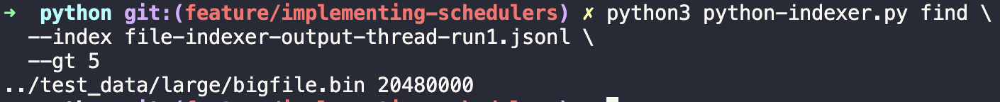
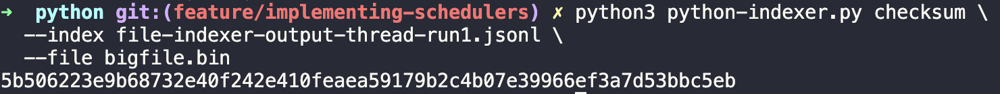
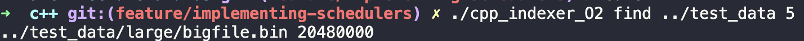
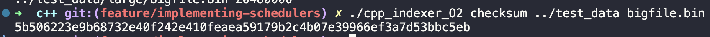

# Architecture and Operating Systems - File Indexers
This repository includes file indexers written in both Python and C++.

Before starting, use the `generate-test-data.py` script to generate the test_data folder in the root directory of this project. It creates a restricted file that may not work on Windows machines. 

## Python 
The Python implementation provides a service‑style file indexer that supports concurrency analysis and CLI‑based queries. Two variants are implemented to evaluate different execution models.

- Variant A — Thread‑pool (GIL‑limited)

- Variant B — Multiprocessing (true multicore)

Both variants implement identical indexing behaviour and differ only in how concurrency is achieved.

### Runtime Instructions

The Python indexer is implemented in python-indexer.py and requires Python Version 3.11.1 or later. 
1. `cd python `
2. Variant A (Thread-pool): `python3 python-indexer.py index \ --root ../test_data \ --variant thread \ --hash sha256 \ --workers 4`
3. Variant B (True-multicore): `python3 python-indexer.py index \ --root ../test_data \ --variant process \ --hash sha256 \ --workers 4`

Explanation of command:
- `index`: runs the indexing phase
- `--root ../test_data`: directory tree to scan
- `--variant <either thread or process>`: selects the thread‑pool or multiprocessing variant
- `--hash sha256`: specifies the hashing algorithm
- `--workers 4`: number of worker threads

Variant A uses a single Python process with worker threads. Due to Python’s Global Interpreter Lock (GIL), CPU‑bound hashing does not execute in parallel across multiple cores.

Variant B uses multiple OS processes, each with its own Python interpreter and GIL, enabling true multicore execution for CPU‑bound hashing tasks.
It produces an identical indexing output to Variant A but with improved performance

### CLI Queries
After indexing, the generated JSONL output can be queried using the following commands.

Find files larger than a given size
`python3 python-indexer.py find \
  --index file-indexer-output-thread-run1.jsonl \
  --gt 5`

  
Outputs the path and sizes of matching files 

Explanation of command: 
- `find`: performs a size‑based query
- `--index`: path to a previously generated index file
- `--gt 5`: lists files larger than 5 MB

Retrieve the checksum for a specific file
`python3 python-indexer.py checksum \
  --index file-indexer-output-thread-run1.jsonl \
  --file bigfile.bin`

Outputs teh stored SHA-256 hash for the specified file

Explanation of command:
- `checksum`: performs a filename‑based lookup
- `--file bigfile.bin`: example of a filename to query

## C++
The C++ implementation provides a service‑style file indexer that mirrors the Python indexer while also supporting toolchain‑based performance analysis. The difference between variants is introduced only at compile time using optimisation flags.

The implementation meets the assignment brief by demonstrating:

- Variant A: a thread‑pool based indexer using `std::thread`

- Variant B: a toolchain alternative using different compiler optimisation levels

- Cryptographic hashing (SHA‑256)

- Command‑line queries for indexed data

The C++ indexer is implemented in `cpp-indexer.cpp` and requires a C++17‑compatible compiler.

### Compilation and Runtime Instructions

1. `cd c++`
2. Variant A: `g++ -std=c++17 -O0 cpp-indexer.cpp -o cpp_indexer_O0` (no compiler optimisation)
4. Variant B: `g++ -std=c++17 -O2 cpp-indexer.cpp -o cpp_indexer_O2` (uses compiler optimisation as the toolchain alternative)

To execute Variant A (Thread-pool indexer)
`./cpp_indexer_O0 index ../test_data 4`

To execute Variant B (Optimised indexer)
`./cpp_indexer_O2 index ../test_data 4`

Explanation of command:
- `index`: runs the indexing phase
- `../test_data`: root directory to scan 
- `4`: number of worker threads

### CLI Queries

After indexing, the indexed data can be queried using the following commands:

Find files larger than a given size
`./cpp_indexer_O2 find ../test_data 5`

Explanation of command:
- `find`: performs a size‑based query
- `../test_data`: directory previously indexed
- `5`: minimum file size in megabytes

Retrieve the checksum for a specific file
`./cpp_indexer_O2 checksum ../test_data bigfile.bin`

Explanation of command:
- `checksum`: performs a filename‑based lookup
- `../test_data`: directory previously indexed
- `bigfile.bin`: filename to query

Both implmentations enable direct comparison of concurrency models, compiler optimisations, and runtime behaviour across languages.